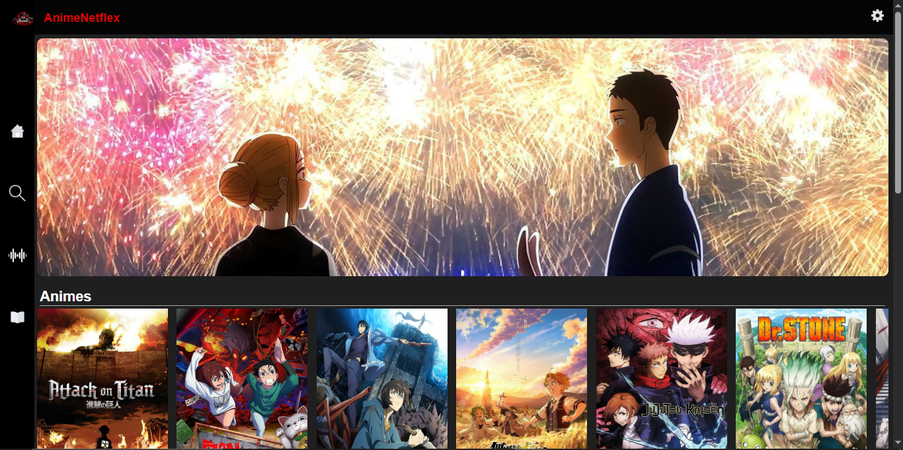
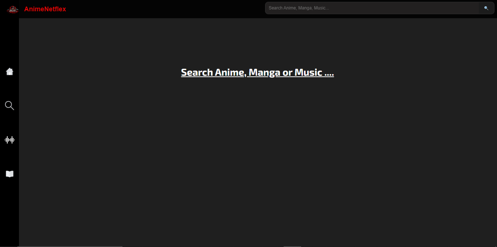
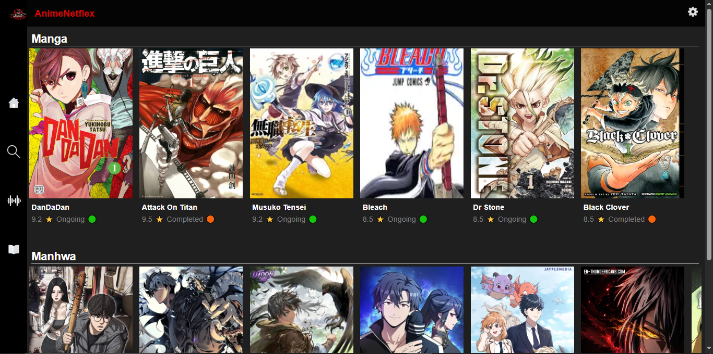
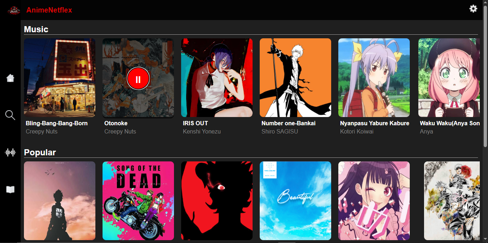
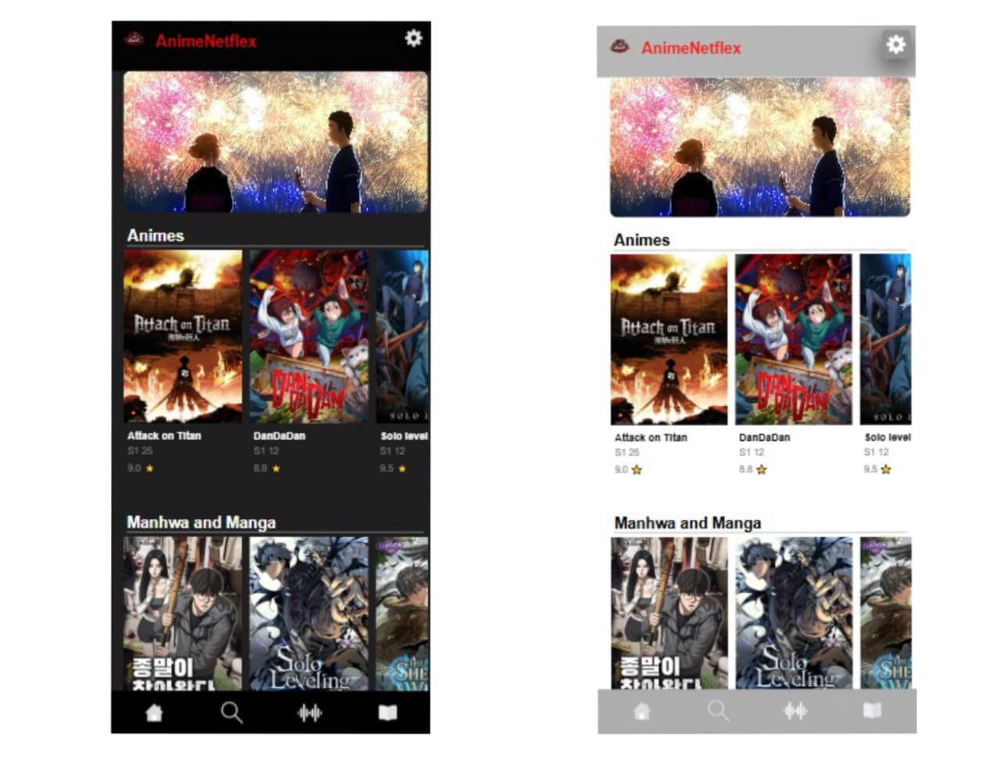

# AnimeNetflex 🎬📚🎵

AnimeNetflex is a personal web project built to organize and discover Anime, Manga, Manhwa, and Music in one place.

## Features

* 🔍 Search Anime, Manga, Manhwa, and Music
* 🎬 Anime categories (Popular, Latest, Movies)
* 📚 Manga and Manhwa sections
* 🎵 Music section with audio playback
* 🌙 Dark/Light mode support
* 📱 Mobile responsive design
* 🗄️ Data stored using MySQL database
* ⚡ Built with Flask and Jinja templates

## Technologies Used

### Frontend

* HTML5
* CSS3
* JavaScript

### Backend

* Python
* Flask

### Database

* MySQL

## Project Structure

AnimeNetflex/
│
├── static/
│ ├── css/
│ ├── js/
│ └── images/
│
├── templates/
│ ├── index.html
│ ├── search.html
│ ├── music.html
│ └── reading.html
│
├── animenetflix.sql
├── app.py
└── README.md

## Home Page

## Home Page - light mode

## Search Page

## Manga Section

## Music Section

## Mobile responsive Home Dark and Light mode

## Installation

1. Clone the repository

git clone https://github.com/rajdeepg025/AnimeNetflix-.git

2. Install dependencies

pip install flask mysql-connector-python

3. Import the database

Import `animenetflix.sql` into MySQL.

4. Run the application

python app.py

5. Change db = mysql.connector.connect() to localhost and Open in browser

http://127.0.0.1:5000

## Future Improvements

* User accounts
* Favorites list
* Watchlist system
* Better search filters
* Admin dashboard

## Author

Created by Rajdeep

This project was built for learning web development using Flask, MySQL, HTML, CSS, and JavaScript. While building AnimeNetflex website it taught me connetions with mysql database and making a static web to dynamic web in the process. I have realized many new thing. As a beginner and studying in class 12 AnimeNetflex turned my imagination to reality. I have also used chatGPT for help and learning by myself. WARNING: this website is for made only for learning porpose.
